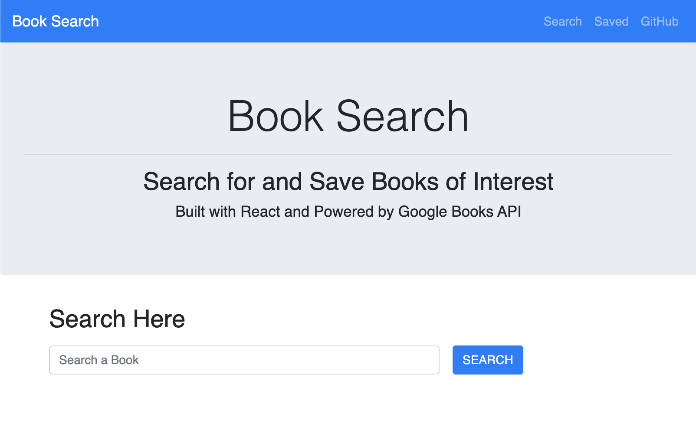

# Book Search

## Description

This is a Full-Stack MERN application (Mongoose/Express/React/Node) that allows users to search for books from the Google Books API. Users can also save their searches to review later as well as remove them from their saved list.

This project was bootstrapped with [Create React App](https://github.com/facebook/create-react-app).

## Deployment 

This App is deployed on [Heroku](https://book-search-robert-alanis.herokuapp.com/search/)

## Technologies used

Full-Stack MERN Application
- [MongoDB](mongodb.com)
- [Express.js](https://expressjs.com)
- [React.js](https://reactjs.org/)
- [Node.js](https://nodejs.org/en/)

MVC design pattern: Model, View, Controller.

Google Books API
